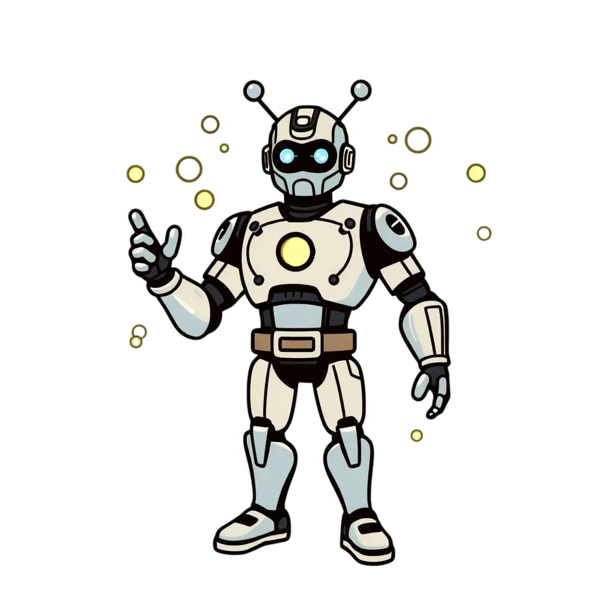

  

  # PARTICLE MAN HELPS YOU FIGHT BAD AIR QUALITY

  A Home Assistant custom integration that brings hyper-local air quality, pollen, and weather data into Home Assistant using Google's APIs — the same data behind health apps and smart HVAC automation worldwide.  This integration intelligently manages API calls so that you can confidently stay within free-tier limits while allowing customization such as multiple locations. 

  [📖 Documentation](https://mnestrud.github.io/particle-man/)

---

# Why Air Quality Matters

Air pollution is the single greatest environmental threat to human health. The [World Health Organization](https://www.who.int/news-room/fact-sheets/detail/ambient-(outdoor)-air-quality-and-health) estimates that ambient air pollution alone causes **4.2 million premature deaths** worldwide each year, driven primarily by heart disease, stroke, chronic obstructive pulmonary disease (COPD), and lung cancer. The more comprehensive [State of Global Air 2024](https://www.stateofglobalair.org/resources/archived/state-global-air-report-2024) report — a joint effort by the Health Effects Institute (HEI), the Institute for Health Metrics and Evaluation (IHME), and UNICEF — found that when indoor sources are included, air pollution accounted for **8.1 million deaths** globally in 2021, making it the **second leading risk factor for death** worldwide. Nearly 90% of those deaths were from noncommunicable diseases: heart disease, stroke, diabetes, lung cancer, and COPD.

Children are especially vulnerable. In 2021, exposure to air pollution was linked to more than **700,000 deaths in children under five** — roughly 15% of all deaths in that age group globally ([State of Global Air 2024](https://www.stateofglobalair.org/resources/archived/state-global-air-report-2024)). Health effects in young children include premature birth, low birth weight, impaired lung development, and increased risk of asthma and respiratory infections.

The problem is not limited to developing nations. In the United States, the EPA's [Our Nation's Air 2025](https://gispub.epa.gov/air/trendsreport/2025/) report found that approximately **109 million Americans** lived in counties exceeding at least one National Ambient Air Quality Standard in 2024. The [American Lung Association's State of the Air 2026](https://www.lung.org/research/sota/key-findings) report — the 27th edition — found that **152 million people** (44% of the U.S. population) live in areas that received a failing grade for unhealthy levels of ozone or particle pollution, including **33.5 million children**. The EPA has documented that long-term and short-term exposures to fine particulate matter (PM2.5) cause premature death and cardiovascular harm, including increased hospital admissions for heart attacks and strokes ([EPA](https://www.epa.gov/clean-air-act-overview/air-pollution-current-and-future-challenges)). Wildfires — a growing source of particulate pollution — are making these trends worse, as the 2023 Canadian wildfire season demonstrated across the Midwest and Eastern states.

The economic toll is staggering. The [World Bank](https://www.unep.org/news-and-stories/video/why-dirty-air-costs-us-trillions-every-year) and [UNEP](https://www.unep.org/topics/air) estimate that the global cost of health damages from air pollution amounts to **$8.1 trillion per year** — equivalent to 6.1% of global GDP. In 2022, the [United Nations General Assembly](https://www.unep.org/news-and-stories/story/historic-move-un-declares-healthy-environment-human-right) recognized clean air as a fundamental component of the universal human right to a clean, healthy, and sustainable environment (Resolution 76/300), passed with 161 votes in favor and zero against.

Nearly every person on Earth breathes air that exceeds WHO guidelines. In 2024, [only seven countries](https://earth.org/all-but-7-countries-faced-unsafe-air-pollution-levels-in-2024-report/) met the WHO's recommended annual PM2.5 standard of 5 µg/m³. The data is clear: air quality is not an abstract environmental issue — it is a daily health decision.

---

I live in Chicago, where wildfires, traffic, industrial activity, and city living cause moment-by-moment changes to air quality. When I started to get serious about improving the air in our house, a few things were important: Reliable & free data, forecasts for not just weather, and plain language action levels built in to the sensors so that you can be informed on taking action.  Thus was born Particle Man. 

Originally I thought this would be a paid-API only integration, but I happily discovered that all of this fits neatly within Google's free API limits for Pollen, Pollution, and Weather.  So I wrote some logic to enforce keeping within the free tier (default, but optional).  I also surface the API usage information for transparency and confidence that this is indeed free.

Just Breathe.

---

## Features

### Air Quality

- **Universal AQI (UAQI)** with health category, dominant pollutant, and trend
- **Air Quality Advisory** — plain-language category for easy automations: Good / Moderate / Unhealthy for Sensitive Groups / Unhealthy / Very Unhealthy / Hazardous
- **Pollutant sensors** — PM2.5, PM10, O3, NO2, CO, SO2 with concentration, EPA health category, and trend; additional pollutants vary by region
- **Hourly AQI forecast** up to 96 hours; **daily AQI forecast** up to 5 days

### Pollen

- **Pollen Advisory** — worst in-season level across all pollen types for easy automations
- **Pollen sensors** by type (Grass, Tree, Weed) with index, color, and trend
- **Daily pollen forecast** up to 5 days with trend and expected peak
- **Per-plant pollen sensors** — individual species (Oak, Ragweed, etc.) with index, trend, and peak

### Weather

- **Native weather entity** — current conditions with hourly (24h), daily (5-day), and twice-daily forecasts; works with all HA weather cards
- **Weather Alerts sensor** — count of active weather warnings with severity, event types, and full alert details (optional)
- **Extra sensors** — Thunderstorm Probability, Heat Index, Wind Chill, UV Index Category

### API Management

- **Automagic mode** — automatically calculates the optimal polling interval based on your enabled APIs, number of locations, and quiet hours; no manual interval tuning needed to stay within the free tier
- **Multi-location support** — shared quota tracking across all locations using the same API key
- **Quiet hours** — skip fetches during a configured overnight window to decrease your polling window during the day
- **API usage sensors** — billing-period call counts with projected usage and status (`ok` / `warning` / `critical`)

→ [Full sensor details](https://mnestrud.github.io/particle-man/sensors/)

---

## Quick Start

1. Get a free Google Cloud API key with the **Air Quality API**, **Pollen API**, and **Weather API** enabled
2. Install via HACS — search for **Particle Man** and restart Home Assistant
3. Go to **Settings → Devices & Services → Add Integration** and search for **Particle Man**
4. Enter your API key — location defaults to your HA home address

→ [Full setup guide](https://mnestrud.github.io/particle-man/)

---

## Documentation

| | |
|---|---|
| [Getting Started](https://mnestrud.github.io/particle-man/) | Quick start and HACS install |
| [Setup](https://mnestrud.github.io/particle-man/setup/) | Full configuration walkthrough |
| [Sensors](https://mnestrud.github.io/particle-man/sensors/) | Every sensor explained in plain language |
| [Weather](https://mnestrud.github.io/particle-man/weather/) | Weather entity, extra sensors, and alerts |
| [Examples](https://mnestrud.github.io/particle-man/examples/) | Dashboard cards, automations, and blueprints |
| [Reference](https://mnestrud.github.io/particle-man/reference/) | Polling math, level scales, troubleshooting |

---

## License

MIT
